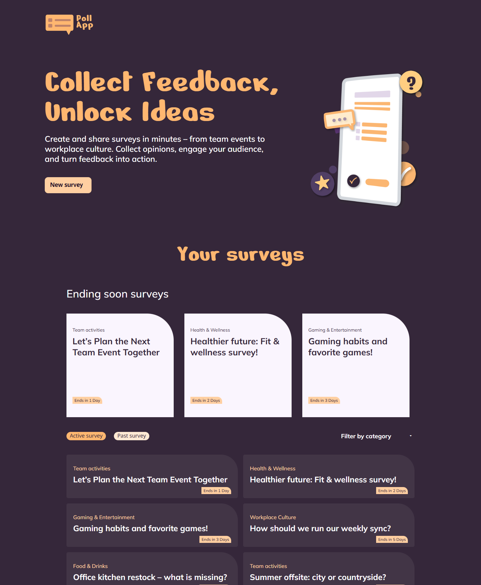
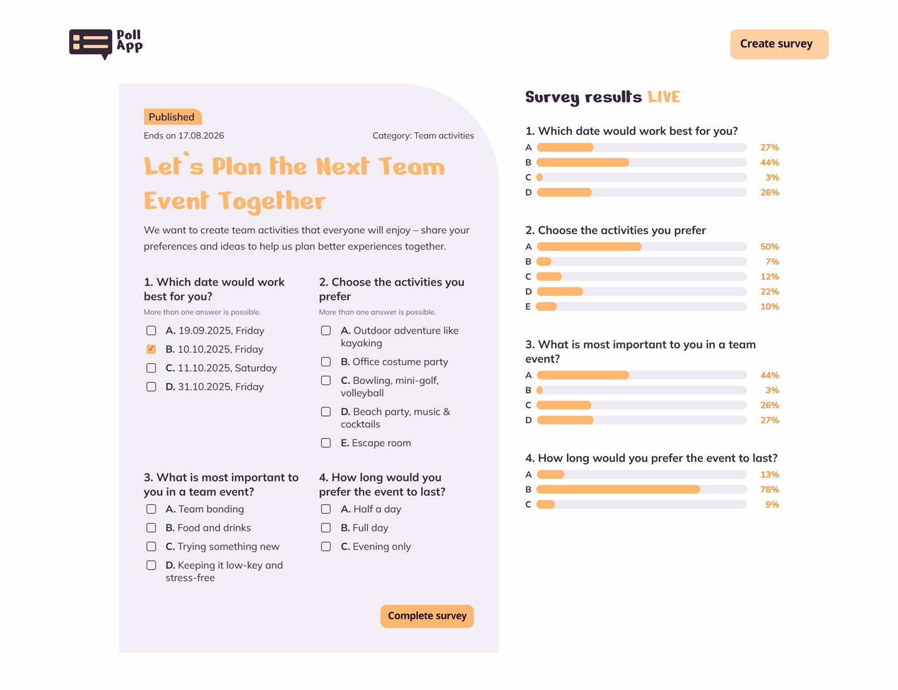
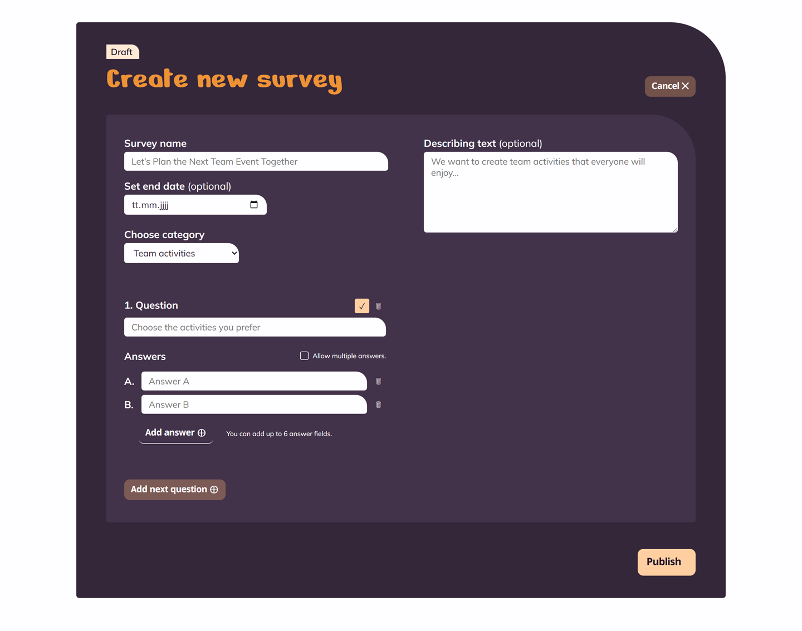
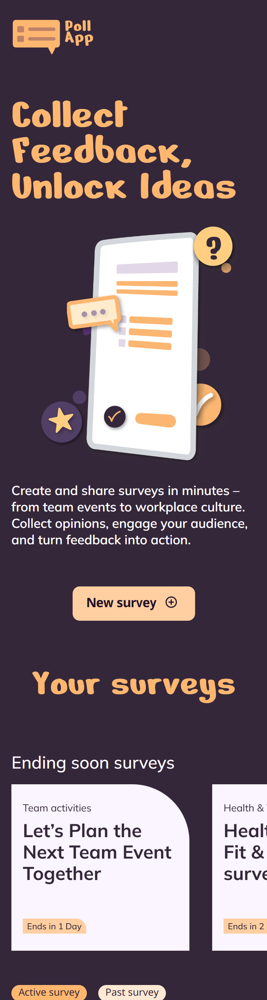
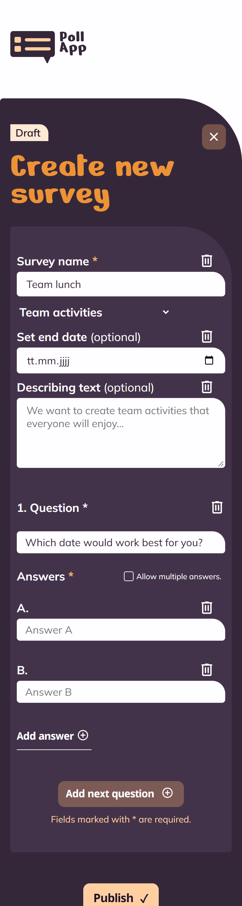

<div align="center">


# Poll App

**Collect Feedback, Unlock Ideas**

Create, share and evaluate surveys in minutes – from the team event to workplace culture.

<br>

[](https://alexander-lindt.developerakademie.net/Poll-App/)
[](https://alexlindt-arch.github.io/Poll-App/)


</div>

<br>

## About the project

Poll App is a survey platform: users create their own surveys with any number of
questions and answers, publish them, cast their vote and watch the evaluation as a
live bar chart right next to the questions.

Built with **Angular 22**: standalone components, signals for the state and the new
control flow in the templates. The design system lives in plain CSS files that are
loaded globally, so the look is identical across every view.

<br>

## Screenshots

### Overview

Hero area, surveys that end soon and the list of all surveys with a switch between
running and finished surveys plus the category filter.



<br>

### Answering a survey – with live evaluation

Every question of a survey, with single or multiple choice depending on the setting.
The results on the right update in real time. In the top right the "New survey"
button and the closing cross lead back into the flow.



<br>

### Creating a survey

Required fields are marked with `*` and are validated. Questions and answer options
can be added and removed on the fly – up to six answers per question. Two questions
sit side by side as soon as both have enough room, otherwise one question fills the
whole width.



<br>

### Mobile

A layout of its own from 320 px: the start page with cards that can be dragged
sideways and the create dialog as a dark block on a light page.

<div align="center">
  
  
</div>

<br>

## Features

| | Feature | Description |
|---|---|---|
| ⏳ | **Surveys ending soon** | Own section above the list, sorted chronologically by end date |
| 🔀 | **Running / finished** | Tabs to switch; finished surveys can be read but no longer answered |
| 🏷️ | **Category filter** | Separate per tab, only offers categories that actually occur, can be reset to "All" at any time |
| ✍️ | **Survey editor** | Overlay dialog with required and optional fields, validation and dynamic questions |
| ☑️ | **Single & multiple choice** | Configurable per question |
| 📊 | **Live evaluation** | Percentage bars next to the questions that keep updating |
| 📱 | **Responsive** | Two fully built layouts: mobile from 320 px, laptop from 769 px; headline and columns grow steplessly with the available room |
| 🎠 | **Draggable highlights** | The cards always stay in one row and can be dragged sideways when they no longer fit next to each other |
| ⌨️ | **Keyboard & a11y** | Escape closes overlays, ARIA roles for dialogs, tabs and the live region |

<br>

## Tech stack

| Area | Implementation |
|---|---|
| Framework | Angular 22 with standalone components, no NgModules |
| State | Signals in `SurveyService`, derived lists via `computed()` |
| Templates | New control flow (`@if`, `@for`) and semantic HTML without inline styles |
| Forms | `FormsModule` with `[(ngModel)]` and validation inside the component |
| Styling | CSS3 with custom properties, flexbox and grid, split into six global files |
| Dependencies | Angular only – plus Google Fonts (Nerko One, Mulish, Nokora) |

<br>

## Project structure

```
Poll-App/
├── src/
│   ├── index.html                    # Document shell with fonts and favicon
│   ├── main.ts                       # Bootstraps the standalone root component
│   ├── styles.css                    # Pulls the six design files together
│   ├── styles/                       # variables, base, layout, components,
│   │                                 # overlay, responsive
│   └── app/
│       ├── app.ts / app.html         # Start page, both overlays, toast
│       ├── models/survey.model.ts    # Interfaces for surveys, questions, draft
│       ├── data/seed-data.ts         # Categories, constants, sample surveys
│       ├── services/
│       │   ├── survey.service.ts     # State, queries, voting, live timer
│       │   ├── label.service.ts      # Date and deadline texts
│       │   └── toast.service.ts      # Confirmation message
│       └── components/
│           ├── survey-teaser/        # Card and list row in one component
│           ├── survey-detail/        # Detail overlay with live evaluation
│           ├── survey-form/          # Create dialog including validation
│           └── bin-icon/             # Delete icon from the design file
├── public/assets/img/                # Logos, icons, hero illustration
└── docs/screenshots/                 # Screenshots for this README
```

<br>

## Running it locally

```bash
git clone https://github.com/alexlindt-arch/Poll-App.git
cd Poll-App
npm install
npm start
```

Then open `http://localhost:4200` in the browser. `npm run build` writes the
production bundle to `dist/poll-app/browser`.

<br>

## Code conventions

The project follows the coding conventions of the Developer Akademie:

| Rule | Status |
|---|---|
| Functions of 14 lines at most | 69 methods, **0 violations** |
| JSDoc above every method | **69 of 69** documented |
| No inline styles in the templates | **0** `style` attributes |
| Templates, styles and logic kept apart | own `.html` file per component, global CSS |
| Meaningful names, typed throughout | interfaces in `survey.model.ts`, no `any` |
| No duplication | card and list row share `SurveyTeaser` |

Angular escapes every interpolated value, so user input can never inject markup.

<br>

## Design system

**Colours**

| | Hex | Usage |
|---|---|---|
|  | `#35273A` | Page background, body text on light surfaces |
|  | `#FFB770` | Primary colour: headlines, buttons, bars |
|  | `#FFCFA1` | Hover state of the primary colour |
|  | `#FEE9D4` | Badges, status labels |
|  | `#FEFDFF` | Card and panel background |
|  | `#F4E9FB` | Surfaces with a slight purple tint |
|  | `#EE9236` | Accent: percentages, error outlines |

**Typography**

| Typeface | Used for |
|---|---|
| **Nerko One** | Headlines and the logo wordmark |
| **Mulish** | Body text, forms, lists |
| **Nokora** | Buttons and small labels |

<br>

## Notes

- The surveys are sample data. There is no backend – created surveys and cast votes
  live in the memory of the page and are gone after a reload.
- The live evaluation simulates incoming votes every couple of seconds so the bars
  visibly move. State changes are applied immutably, which is what makes the
  zoneless change detection of Angular 22 pick them up.
- The first implementation in vanilla HTML, CSS and JavaScript is preserved in the
  [`vanilla-js`](https://github.com/alexlindt-arch/Poll-App/tree/vanilla-js) branch,
  the original design export (React via CDN) in
  [`design-export`](https://github.com/alexlindt-arch/Poll-App/tree/design-export).

<br>

## Author

**Alexander Lindt** – freelance web designer, Ingolstadt
[alexanderlindtwebdesign.com](https://alexanderlindtwebdesign.com) · [GitHub](https://github.com/alexlindt-arch)
